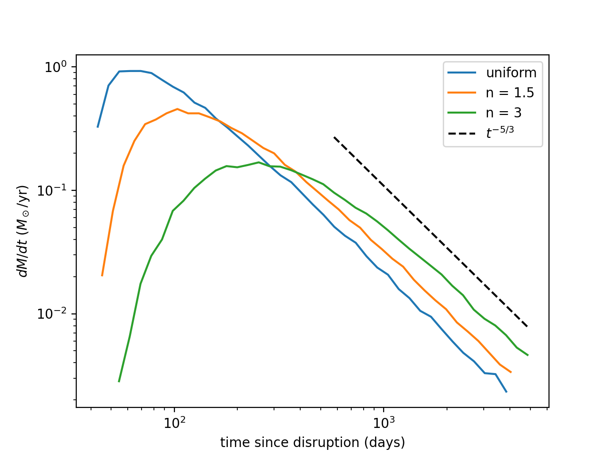

# TDE-fallback

Test-particle simulation of the mass fallback rate after a tidal disruption event (TDE), in the frozen-in approximation.

A star on a parabolic orbit is disrupted at pericentre by a supermassive black hole. The debris is treated as non-interacting particles moving in the black hole's Newtonian potential. The code computes the fallback rate $dM/dt$ in two independent ways (analytically from the particle energies, and by direct orbit integration) and compares stars of different internal structure.

This is a self-study project written in October 2026 to learn the basic physics of TDEs. It reproduces known results (Rees 1988; Lodato, King & Pringle 2009) and is not new research.

## Results

**Fallback rate and stellar structure.** The fallback rate rises, peaks, and settles onto the $t^{-5/3}$ power law at late times. More centrally concentrated stars peak later and lower.



| Star | Peak rate ($M_\odot$/yr) | Peak time (days) |
| --- | --- | --- |
| Uniform sphere | ~0.9 | ~65 |
| $n = 1.5$ polytrope | ~0.45 | ~110 |
| $n = 3$ polytrope | ~0.17 | ~250 |

Values are read off the plot for $M_{\rm bh} = 10^6\,M_\odot$, a Sun-like star and $\beta = 1$.

**Direct simulation agrees with the energy-based prediction.** Integrating the bound debris with a leapfrog scheme and recording each particle's return to pericentre reproduces the analytic curve in every bin out to 369 days. Individual return times agree with the Keplerian prediction to 0.23%.


**Energy distribution.** The fallback curve is the energy distribution $dM/dE$ mapped through Kepler's third law.


## Physics

The star is disrupted when it passes within the tidal radius

$$r_t = R_\star \left(\frac{M_{\rm bh}}{M_\star}\right)^{1/3}.$$

In the frozen-in approximation, every fluid element keeps the centre-of-mass velocity at pericentre and afterwards moves ballistically. The spread in specific orbital energy across the star is then

$$\Delta E \simeq \frac{G M_{\rm bh} R_\star}{r_t^2},$$

so roughly half the debris is bound. A bound particle with energy $E < 0$ returns to pericentre after one orbital period,

$$T = \frac{2\pi G M_{\rm bh}}{(2|E|)^{3/2}},$$

and the fallback rate is

$$\frac{dM}{dt} = \frac{dM}{dE}\,\frac{dE}{dt}, \qquad \frac{dE}{dt} \propto t^{-5/3}.$$

The curve is a pure $t^{-5/3}$ power law only where $dM/dE$ is flat, which holds near $E = 0$, that is, at late times. Early on, the curve traces the shape of $dM/dE$, which is set by the star's density profile.

## Method

1. **Units.** $G = 1$, masses in $M_\odot$, lengths in $R_\odot$, which fixes the time unit at about 1593 s.
2. **Stellar models.** A uniform sphere by rejection sampling, and polytropes ($n = 1.5$, $n = 3$) by solving the Lane–Emden equation with a fourth-order Runge–Kutta integrator and inverting the cumulative mass profile.
3. **Initial conditions.** The star is placed at pericentre ($r_p = r_t/\beta$) and every particle is given the parabolic centre-of-mass velocity.
4. **Fallback from energies.** Return times follow from the energies through Kepler's third law and are binned into $dM/dt$.
5. **Direct integration.** Bound particles are advanced with a kick-drift-kick leapfrog scheme ($dt = 0.01\,t_p$); the return time is the first change of sign of $\mathbf{r}\cdot\mathbf{v}$ from negative to positive.

## Validation

| Check | Result | Expected |
| --- | --- | --- |
| Lane–Emden surface, $n = 1$ | 3.1411 | $\pi$ |
| Lane–Emden surface, $n = 1.5$ | 3.6531 | 3.65375 |
| $-\xi^2\theta'$ at surface, $n = 1.5$ | 2.71406 | 2.714 |
| Sampled radial profile, uniform sphere | follows $3r^2/R^3$ | |
| Sampled radial profile, polytrope | follows $\xi^2\theta^n$ | |
| Bound fraction of debris | 0.5 | 0.5 |
| Energy range ($n = 1.5$, $N = 5000$) | −88.5 to +88.6 | within $\pm\Delta E = \pm 100$ |
| Circular orbit, relative energy error after one period | $1.2 \times 10^{-14}$ | machine precision |
| Parabolic orbit, distance at $t = 100\,t_p$ | 3460 | 3458 (analytic) |
| Direct vs predicted return time, maximum difference | 0.23% | consistent with integrator energy error |

## Running the code

Requires Python 3 with NumPy and Matplotlib.

```bash
pip install numpy matplotlib

python LaneEmden.py   # Lane-Emden solver and polytrope sampler checks
python TDE_2.py       # uniform sphere sampler checks
python S3A.py         # energy spread at pericentre
python trial.py       # integrator tests and fallback curves
python Full_run.py    # direct simulation cross-check (long run)
```

Figures are written to `figures/`.

| File | Contents |
| --- | --- |
| `TDE_units.py` | Units, parameters and derived scales |
| `TDE_2.py` | Uniform sphere sampler |
| `LaneEmden.py` | Lane–Emden solver and polytrope sampler |
| `S3A.py` | Placement of the star at pericentre |
| `forces.py` | Black hole gravity and specific energy |
| `integrator.py` | Leapfrog step |
| `trial.py` | Integrator tests, fallback rate from energies, model comparison |
| `Full_run.py` | Direct integration and comparison with the analytic curve |

## Limitations

- **No self-gravity or hydrodynamics.** The debris is ballistic from the moment of disruption; pressure, shocks and the stream's own gravity are ignored.
- **Newtonian gravity.** The pericentre speed is about 0.2c, so relativistic effects such as apsidal precession are not negligible in reality.
- **Complete disruption assumed.** At $\beta = 1$, hydrodynamic simulations find that an $n = 3$ star is only partially disrupted and its core survives (Guillochon & Ramirez-Ruiz 2013). The $n = 3$ curve here is the frozen-in idealisation, not a prediction.
- **Energy frozen in at pericentre.** Later work shows the energy spread is set near the tidal radius and depends only weakly on $\beta$ (Stone, Sari & Loeb 2013), so this setup should not be used to study the dependence on $\beta$.
- **Fallback is not accretion.** The curve gives the rate at which debris returns to pericentre, not the luminosity.

## Planned

- Time-step convergence test and energy-conservation plot
- Debris stream snapshots, including unbound material
- Pseudo-Newtonian (Paczyński–Wiita) potential to show apsidal precession of the stream

## References

- Rees, M. J. 1988, Nature, 333, 523
- Phinney, E. S. 1989, IAU Symposium 136, 543
- Lodato, G., King, A. R., & Pringle, J. E. 2009, MNRAS, 392, 332
- Stone, N., Sari, R., & Loeb, A. 2013, MNRAS, 435, 1809
- Guillochon, J., & Ramirez-Ruiz, E. 2013, ApJ, 767, 25

## Author

Malapaka Venkata Ratna Abhishek

